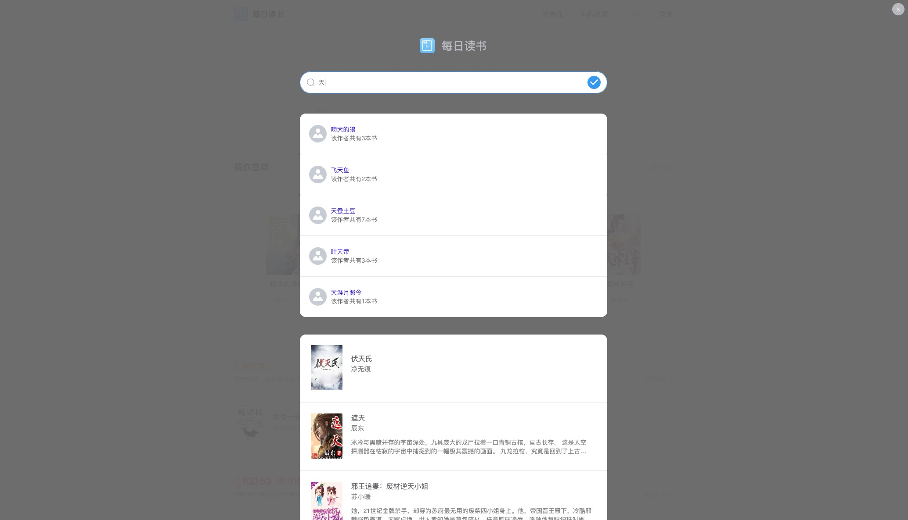
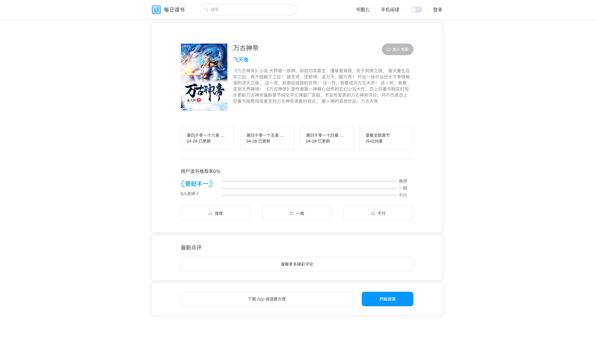
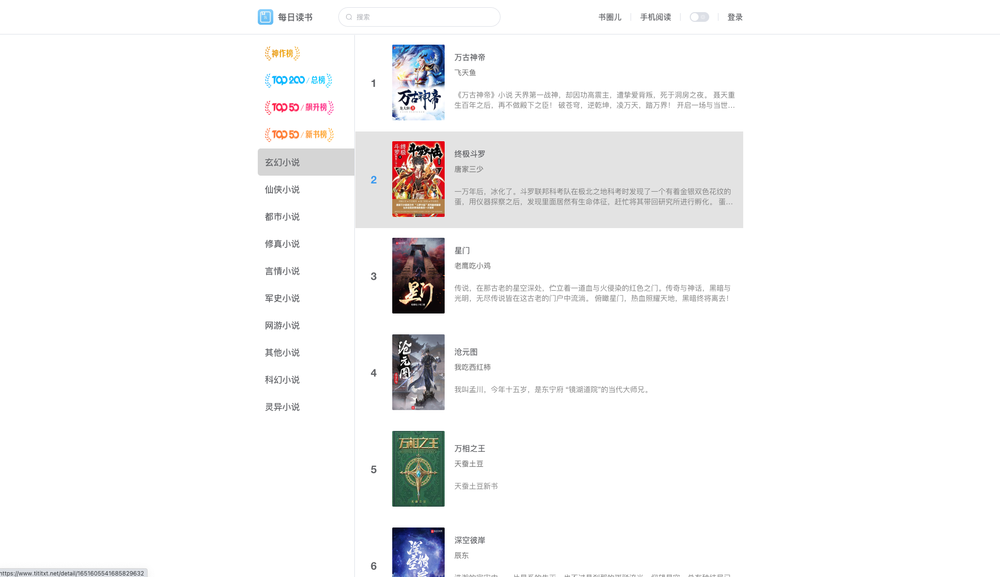
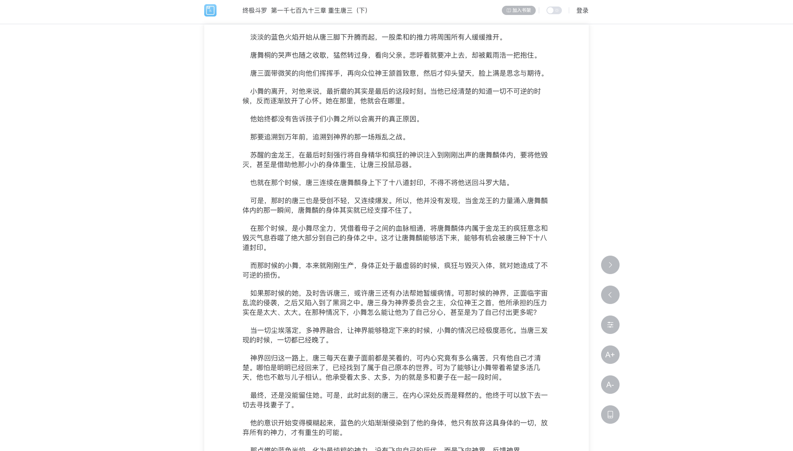
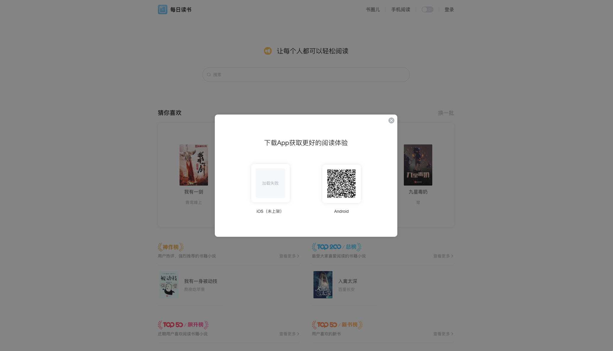

## 仿微信阅读PC端 Vue 3 + Vite + Element UI Plus
页面布局功能部分仿照微信阅读PC端功能，代码开源仅供学习使用！

## 体验地址
每日阅读PC端地址 : https://www.tititxt.net
## flutter 移动端开源代码：
https://github.com/haojias/edrb.git

## 数据接口
https://api.tititxt.net
> 如有需要请联系我申请 APP_ID 、SECRET_KEY

## 联系我
`qq：713347148`  
`email：haocjia@126.com`

## 展示图

#### 首页展示图

#### 搜索展示图

#### 详情展示图

#### 其他展示图

